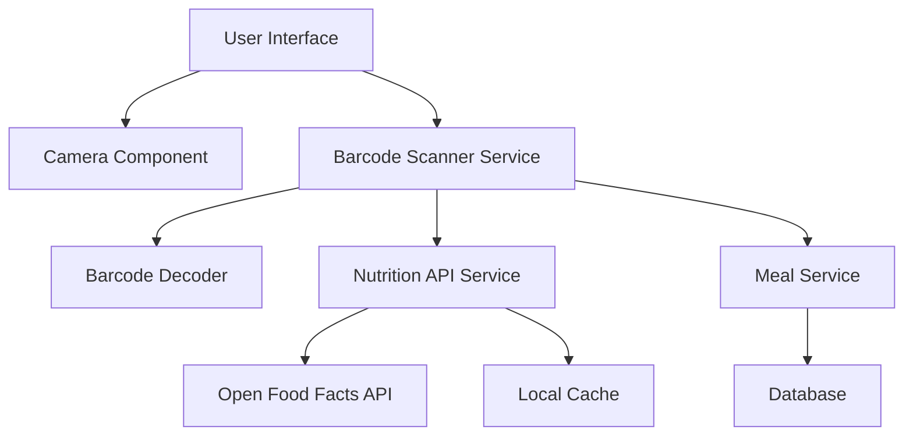

# Barcode Scanner Design Document

## Overview

The Barcode Scanner feature will integrate camera-based barcode detection with nutrition database APIs to provide seamless food logging for packaged products. The system will use client-side barcode decoding libraries and external nutrition APIs to retrieve accurate product information, with local caching for offline functionality.

## Architecture

### High-Level Architecture



### Technology Stack

- **Barcode Detection**: `@zxing/library` for robust barcode decoding
- **Camera Access**: Browser MediaDevices API with React hooks
- **Nutrition Data**: Open Food Facts API (free, comprehensive database)
- **Caching**: IndexedDB for offline product storage
- **UI Components**: React with TypeScript, Tailwind CSS styling

## Components and Interfaces

### 1. BarcodeScanner Component

**Purpose**: Main scanner interface with camera view and barcode detection

**Props**:
```typescript
interface BarcodeScannerProps {
  onProductFound: (product: ScannedProduct) => void;
  onError: (error: ScanError) => void;
  onClose: () => void;
}
```

**Key Features**:
- Full-screen camera view with overlay
- Real-time barcode detection
- Visual feedback for scan states
- Error handling and user guidance

### 2. ProductReview Component

**Purpose**: Display and edit scanned product information before saving

**Props**:
```typescript
interface ProductReviewProps {
  product: ScannedProduct;
  onSave: (meal: MealData) => void;
  onCancel: () => void;
}
```

**Key Features**:
- Editable nutrition information
- Serving size adjustment with live calculation
- Product image display
- Notes and description fields

### 3. BarcodeService

**Purpose**: Core service for barcode processing and data retrieval

**Methods**:
```typescript
class BarcodeService {
  async decodeBarcode(imageData: ImageData): Promise<string>
  async getProductInfo(barcode: string): Promise<ProductInfo>
  async cacheProduct(barcode: string, product: ProductInfo): Promise<void>
  async getCachedProduct(barcode: string): Promise<ProductInfo | null>
}
```

### 4. NutritionAPI Service

**Purpose**: Interface with external nutrition databases

**Methods**:
```typescript
class NutritionAPIService {
  async searchByBarcode(barcode: string): Promise<ProductInfo>
  async searchByName(productName: string): Promise<ProductInfo[]>
  private formatNutritionData(apiResponse: any): ProductInfo
}
```

## Data Models

### ScannedProduct Interface

```typescript
interface ScannedProduct {
  barcode: string;
  name: string;
  brand?: string;
  imageUrl?: string;
  nutrition: {
    calories: number;
    protein: number;
    carbs: number;
    fat: number;
    fiber?: number;
    sugar?: number;
    sodium?: number;
  };
  serving: {
    size: number;
    unit: string;
    description: string;
  };
  source: 'openfoodfacts' | 'cache' | 'manual';
}
```

### ScanError Interface

```typescript
interface ScanError {
  type: 'camera_permission' | 'barcode_not_found' | 'product_not_found' | 'network_error';
  message: string;
  suggestions: string[];
}
```

### CachedProduct Interface

```typescript
interface CachedProduct {
  barcode: string;
  product: ScannedProduct;
  cachedAt: Date;
  expiresAt: Date;
}
```

## Error Handling

### Camera Permission Errors
- Detect permission denial and provide clear instructions
- Offer alternative manual barcode entry
- Guide users to browser settings for permission management

### Barcode Detection Errors
- Timeout handling after 10 seconds of unsuccessful scanning
- Poor lighting detection with flash/brightness suggestions
- Invalid barcode format handling with manual entry fallback

### Network and API Errors
- Graceful degradation to cached data when offline
- Retry logic for temporary network failures
- Clear error messages with actionable next steps

### Product Not Found Errors
- Option to manually enter product information
- Suggestion to try alternative barcode angles
- Integration with existing manual meal entry workflow

## Testing Strategy

### Unit Tests
- BarcodeService barcode decoding accuracy
- NutritionAPIService data formatting and error handling
- Serving size calculation logic
- Cache management functionality

### Integration Tests
- Camera permission flow
- End-to-end barcode scanning workflow
- API integration with Open Food Facts
- Offline functionality with cached products

### User Experience Tests
- Scanner performance in various lighting conditions
- Barcode detection accuracy across different product types
- Mobile responsiveness and touch interactions
- Accessibility compliance for camera interfaces

### Performance Tests
- Camera initialization time
- Barcode detection speed
- API response time monitoring
- Cache retrieval performance

## Security Considerations

### Camera Privacy
- Clear user consent for camera access
- No image storage or transmission beyond barcode detection
- Immediate disposal of camera frames after processing

### API Security
- Rate limiting for nutrition API calls
- Input validation for barcode data
- Secure handling of cached product information

### Data Validation
- Sanitization of product names and descriptions
- Validation of nutrition values for reasonable ranges
- Prevention of malicious barcode injection

## Integration Points

### Existing Meal Logging System
- Seamless integration with current MealForm component
- Consistent data format with manual meal entries
- Shared validation and saving logic

### Navigation Integration
- Add barcode scanner option to meal entry methods
- Consistent UI patterns with existing scan functionality
- Proper routing and state management

### Database Integration
- Extend existing Meal model to include barcode field
- Maintain compatibility with current nutrition calculations
- Preserve meal history and analytics functionality

## Performance Optimization

### Camera Performance
- Efficient frame processing with requestAnimationFrame
- Debounced barcode detection to prevent excessive processing
- Automatic camera cleanup on component unmount

### API Optimization
- Request caching to minimize duplicate API calls
- Batch processing for multiple barcode scans
- Intelligent cache expiration based on product type

### Mobile Optimization
- Optimized camera resolution for barcode detection
- Touch-friendly interface elements
- Efficient memory management for continuous scanning